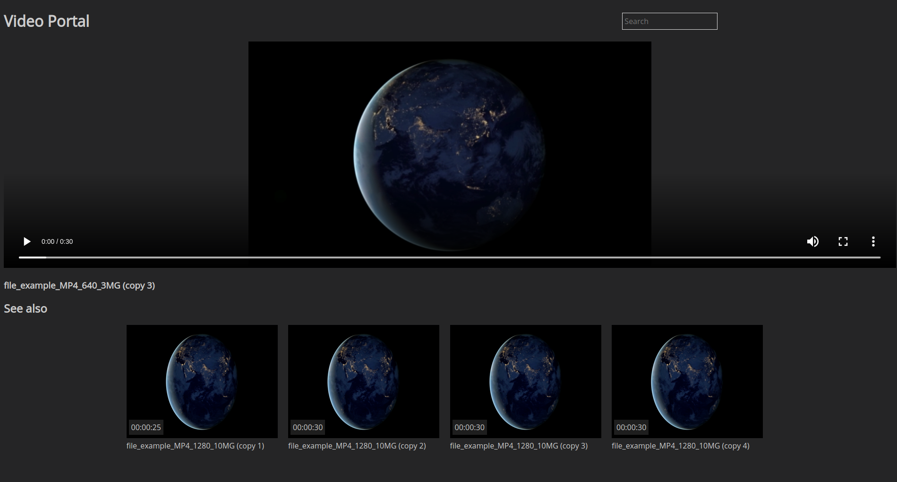

# Video Portal

## Description

Simple portal for video files sharing

Supports:

* video preview on mouse hover

* video playback

* suggestions (random selection of other videos)

* pagination

* search (by name)

* sorting

* integrated tool for database initialization from existing     video content

* Multiple database options for metadata storage, currently MongoDB and SQLite

## Requirements

* MongoDB server

* NodeJS

* Yarn / NPM

* ffmpegthumbnailer

## Installation

    yarn

or

    npm install

## Setup

In project root create a directory for video files (or symlink to existing directory) and name it `content`

Set env variables:

`USERNAME` - basic auth username for portal

`PASSWORD` - basic auth password for portal

`MAX_ITEMS` - max number of video thumbnails on single page

`DB_ENGINE` - Selected DB to use (mongo or sqlite)

`MONGO_URL` - MongoDB url (valid for DB_ENGINE=mongo)

`SQLITE_DB_PATH` - Path to SQLite database file (valid for DB_ENGINE=sqlite)

`PORT` - http server port

`APP_NAME` - portal name displayed in views

otherwise defaults will be used

Optionally you can change default content path with variable

`CONTENT_DIR`

## Database init

    node db-init.js

This will generate metadata and thumbnails for all videos found in content directory and store it in database

## Run

    node server.js

